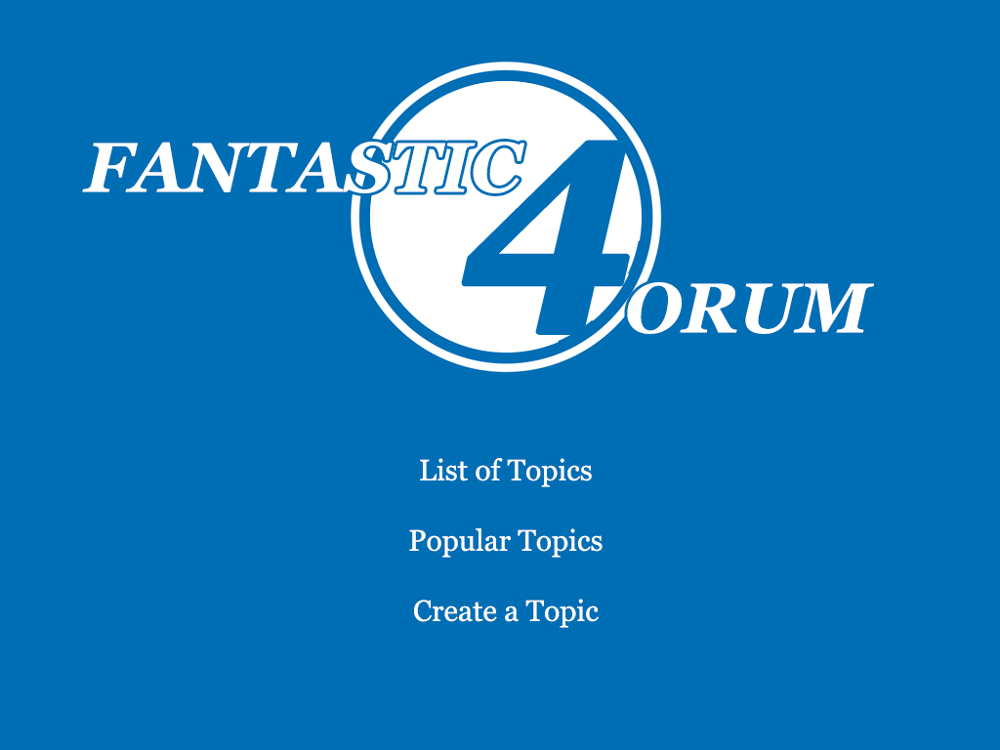

___
#<center>_Fantastic Forum_
___

*Jake wants to create a forum so that he and his friend can create topics of discussion and be able to comment on them. Jake wants to see a list of current topics and his friend should be able to vote on the topics and Jake should be able to see which topics have the most comments.  He also wants to have all comments written in Markdown and be able to tag comments automatically by location.*

##<center>Features
---

- Users will connect to the forum server by its IP address and port number followed by a back slash in their browsers url.

Example:

> 127.0.0.1:3000/

This will take the user to the landing page (index page).

```
app.get("/")
```
<center>

- Users can choose from one of the following buttons/links: `List Topics`, `Popular Topics` and `Create a Topic`.

###<center>`Lists of Topics`
---

If the user clicks List of Topics, a list of all the topics will be presented.  

```
app.get("/list")
```
<center>

- The user can then choose one of the topics from the list to view its current comments, add a comment and can vote for the topic.

> User clicks `Top 5 space movies`.

```
app.get("/topic/:id")
```
<center>

- If the user clicks "Add Comment", they will be taken to a text input form.

> User clicks `Add Comment`.

```
app.post("/topic/:id/createCom")
```
<center>

> The user then puts his chosen user name and his/her comment into the corresponding input fields.  Thru an API, the location of the user will be given along side the user name.

<center>

- When the user clicks the `Submit` button/link they will be directed a "thanks for your comment" page in which they will be redirected to the previous topic page in a few seconds.

```
app.get("/topic/:id/thksCom")
```
<center>

- Upon returning to the topic page, the user will see that there post is among the comments.

```
app.get("/topic/:id")
```
<center>

- If user clicks `VOTE!` from the topic page, they will be directed to a "thank you" page and be shortly redirected back to the previous topic page in a few seconds.

```
app.post("/topic/:id/thksVote")
```
<center>

After several seconds the user will be redirected to the topic page.

```
app.get("/topic/:id")
```

- The `Back` button/link will return to the previous page.

###<center>`Popular Topics`
---

- When the user chooses `Popular Topics`, a list of topics arranged in descending order by number of comments.  The number of votes will also be displayed.

```
app.get("/popTops")
```
<center>

- The `Back` button/link will return to the previous page.

###<center>`Create a Topic`
---

- Clicking on the `Create a Topic` will direct the user to an input page.

```
app.post("/topic/createTop")
```
<center>

> For example, the user creates a new topic "My favorite First-Person shooter video games."

<center>

- Clicking the `Submit` button/link will direct the user to a "You Created a New Topic" page and will be redirected to the home page after several seconds.

```
app.get("/thksNewTop")
```
<center>

> And then redirected to the List of Topics page.

```
app.get("/list")
```
<center>
